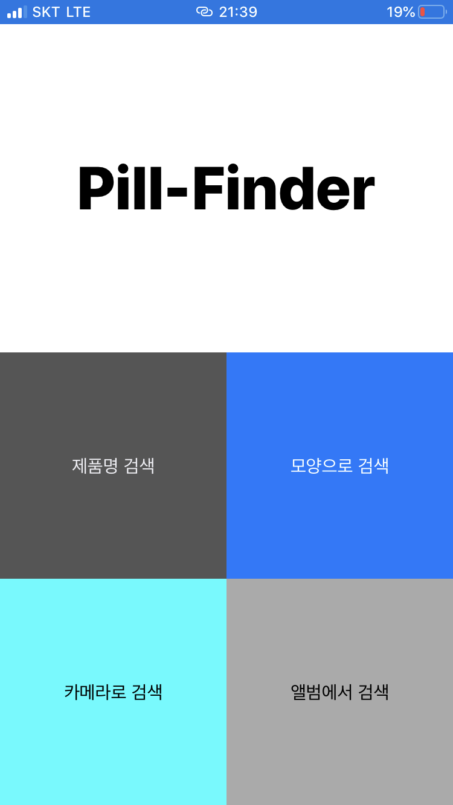
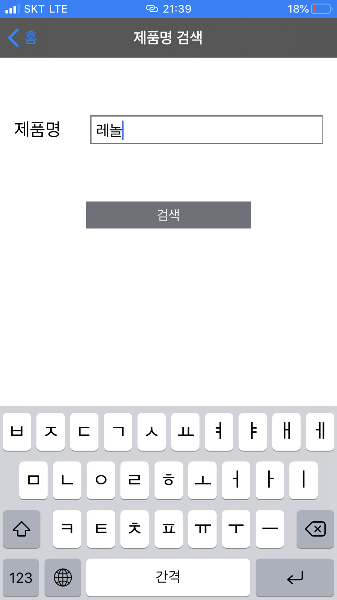
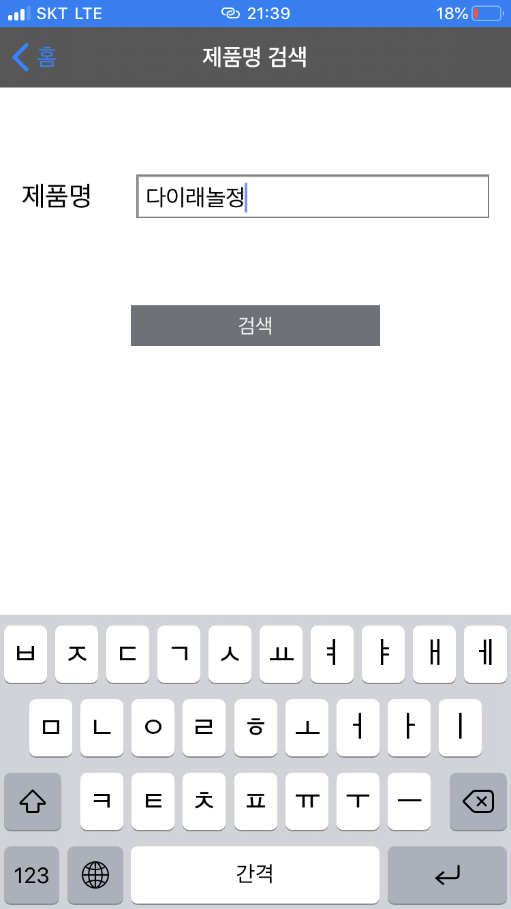
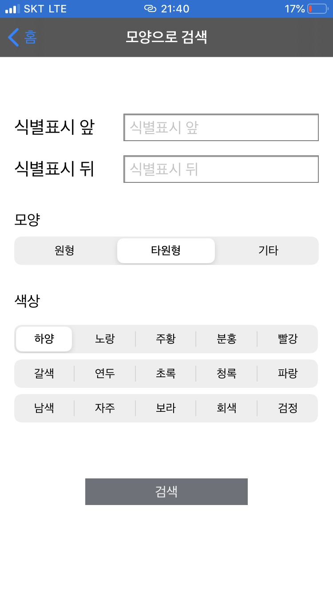
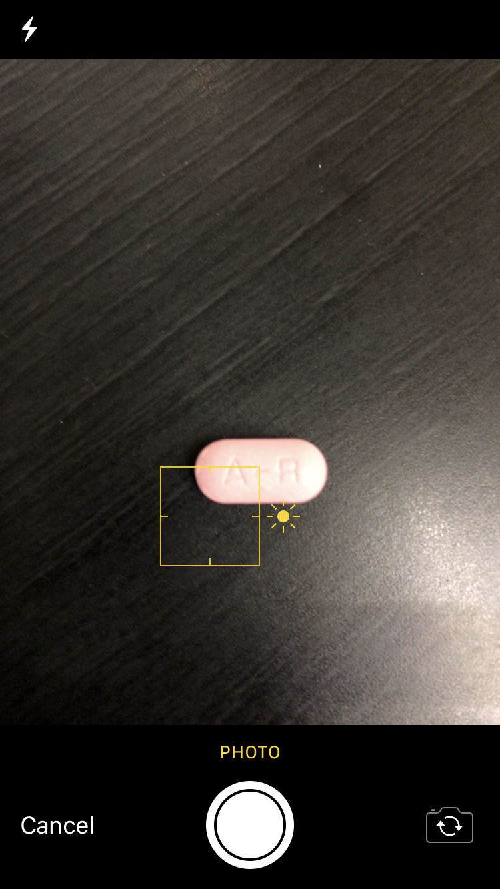
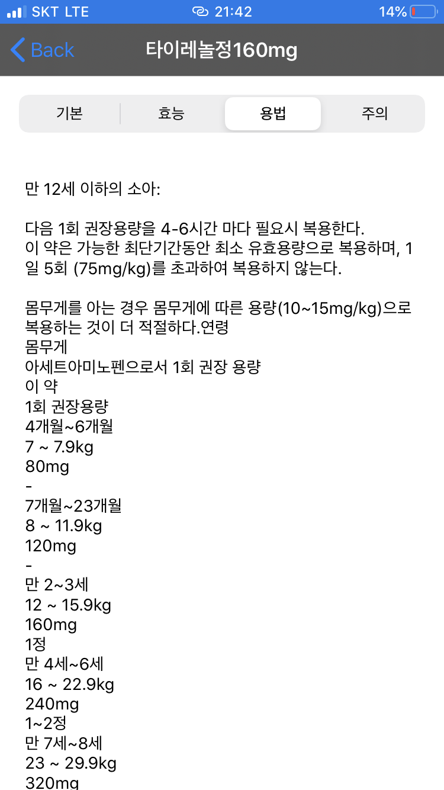

# 필파인더 (Pill-Finder)

사진으로 약의 정보를 알 수 있는 어플리케이션입니다.

`tensorflow` 기반의 학습을 사용하여 사진 속 `알약의 색깔`, `알약의 모양`, `알약 속 글씨`를 얻어, 알약에 대한 정보를 알아냅니다.
+ 알약의 정보에는 성분정보, 효능효과, 용법용량, 주의사항 등을 나타냅니다.

사진뿐 아니라, 직접 알약에 대한 정보를 입력하여 검색이 가능합니다.

_주 : 정제형 알약의 경우에만 검색 및 사용이 가능하며, 캡슐형 또는 액체형 물약등의 경우에는 사용이 불가합니다._

## 설치 방법 (Installation)

안드로이드 폰의 Play Store, 아이폰(iPhone) 또는 아이패드의(iPad)의 App Store에서 **`필파인더`** 어플리케이션을 다운로드합니다. **정식 배포가 아직 되지 않았습니다. 정식 배포가 되면 수정합니다.**

### 적용 OS
|대상 OS|버전|
|:---:|---|
|Android|아직 정식 배포가 되지 않았습니다. 잠시만 기다려 주세요.|
|iOS|아직 정식 배포가 되지 않았습니다. 잠시만 기다려 주세요.|
|iPad OS|아직 정식 배포가 되지 않았습니다. 잠시만 기다려 주세요.|

## 사용 방법 (Usage)

어플리케이션을 시작하면 아래와 같이 4가지의 메뉴가 나타납니다.

 

### 1. 제품명으로 검색

알약의 제품명을 알고 있다면, 현재 메뉴에서 제품명을 직접 검색합니다.
정확히 알고 있지 않더라도, 검색이 가능합니다.
예를 들어, `타이레놀정` 제품명을 검색시, `타이레` 또는 `레놀` 등으로 검색하여도 됩니다.

하지만, 제품명의 오기는 검색이 불가합니다. 예를 들어, `다이래놀정`과 같은 방법으로는 `타이레놀정`에 대한 검색이 불가합니다.

### 2. 모양으로 검색

알약의 앞 뒷면 글씨, 알약의 모양, 알약의 색깔 중 사용자가 알고 있는 정보를 바탕으로 검색합니다.

알약의 색깔은 정확하지 않아도 검색됩니다. 예를 들어, `자주`와 `보라`처럼 비슷한 색깔은 같은 색의 결과로서 검색됩니다.

알약 속의 글씨를 한 면만 알고 있을 경우 앞면 글씨 검색에 입력하여 주시기 바랍니다.

알약의 분할선의 경우 무시하셔도 무방합니다.

### 3. 카메라로 검색

단색인 배경 속에 놓인 알약을 사진으로 찍어 알약에 대한 정보를 알아냅니다.
**알약을 카메라의 정중앙에 위치해서 찍어야 합니다. 그렇지 않으면, 정확한 정보를 알 수 없습니다.**

+ 학습되어진 알약 모델을 통해 찍은 사진 속의 글씨, 모양, 색깔을 판별합니다.

+ 판별된 정보를 통해 알약을 검색합니다.

알약정보는 정확하지 않을 수 있습니다.

### 4. 앨범에서 검색

단색인 배경 속에 놓인 알약 사진을 앨범에서 찾아 알약에 대한 정보를 알아냅니다.

+ 학습되어진 알약 모델을 통해 찍은 사진 속의 글씨, 모양, 색깔을 판별합니다.

+ 판별된 정보를 통해 알약을 검색합니다.

알약정보는 정확하지 않을 수 있습니다.

### 알약 정보 확인
위 4가지의 방법 중 하나로 알약의 정보를 검색하였다면 검색한 정보를 담고 있는 알약들을 보여줍니다.

검색된 알약들 중 원하는 알약을 선택하면, 다음과 같이 `성분정보`, `효능효과`, `용법용량`, `주의사항` 등을 보여줍니다.

## 기여 방법 (Contribution)

+ 알약을 판별하기 위한 학습을 돕고 싶다면 `master` 브랜치로 `pull request`를 보내주세요.

	+ 현재 알약 사진 학습 및 판별을 위해 사용하는 언어 및 라이브러리의 버전은 다음과 같습니다.
	
        |언어 및 라이브러리|버전|
        |:-------------|---|
        |Python|3.7|
        |OpenCV|4.1.1.26|
        |tensorflow|1.13.2|
     
     + 학습 및 판별을 위해 사용되는 파일에 대한 설명은 다음과 같습니다.

        |파일 이름|설명|
        |-------|---|
        |test.py|학습된 모델을 통해 이미지를 판별합니다.|
        |char_test.py|글자 이미지에서 글자를 추출합니다.|
        |shape_test.py|모양 이미지에서 모양을 추출합니다.|
        |image_processing.py|알약 이미지에서 글자 판별을 위해 필요한 이미지와 모양 이미지, 색상을 추출합니다.|
        |textfind.py|글자 추출을 위해 변형된 이미지에서 글자 이미지만을 이미지 배열로 추출합니다.|
        |make_square.py|이미지를 여백을 넣어 정사각형으로 만듭니다.|
        |train.py|데이터 학습을 위해 사용됩니다.|
        |read_write_tfrecords|사진 학습을 위해 tfrecord 파일을 만들고 사용합니다.|

+ 원하는 알약에 대한 정보가 없다면, 또는 원하는 알약에 대한 정보가 부족하다면 `issue`를 남겨주세요.

## 라이센스 (License)
[MIT](LICENSE)

